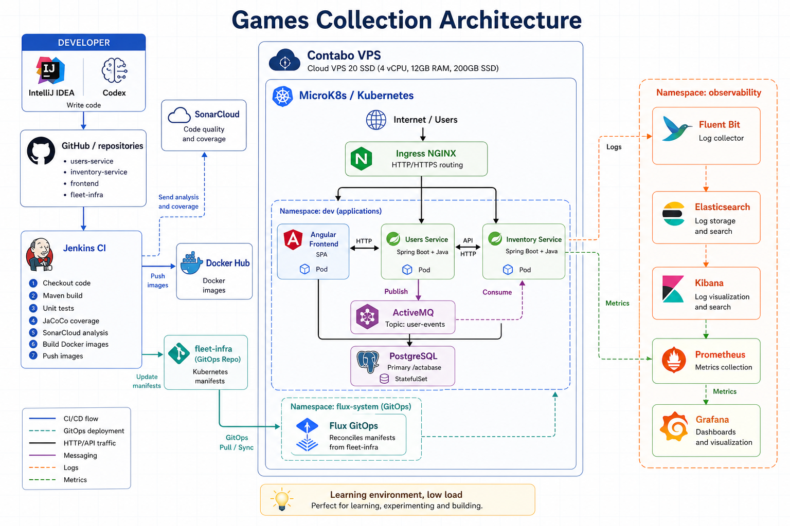

# Games Collection Frontend

Angular frontend for Games Collection. It provides the web interface for authentication, personal game collections, inventory administration, and user administration.



## What It Does

- JWT login.
- Redirects unauthenticated users to login.
- Protects navigation by role.
- Provides a personal collection section for authenticated users.
- Provides an inventory section for administrators.
- Manages games, platforms, and studios.
- Manages users, including private user photos.
- Provides lists with search, sorting, and pagination.
- Integrates with `users-service` and `inventory-service`.

## Tech Stack

- Angular 17
- TypeScript
- RxJS
- Angular Router
- Angular Forms
- NGINX for serving the production build in Docker/Kubernetes
- Jenkins + Kaniko for Docker image publishing

## Requirements

- Node.js 20 recommended
- npm

## Clone

```bash
git clone <frontend-repository-url>
cd games-collection-frontend
```

## Install Dependencies

```bash
npm ci
```

For local development you can also use:

```bash
npm install
```

## Configuration

The API base URL is configured in:

```text
src/environments/environment.ts
```

Current value:

```ts
apiBaseUrl: '/gamescollection'
```

This value is intended for execution behind the Kubernetes Ingress:

```text
http://oscarfndez.eu/gamescollection/
```

If you run the frontend locally against local backends, adjust `apiBaseUrl` as needed.

## Run Locally

```bash
npm start
```

Default URL:

```text
http://localhost:4200
```

## Build

```bash
npm run build
```

Output directory:

```text
dist/game-collection-frontend
```

## Main Routes

```text
/login
/collection
/profile
/inventory/games
/inventory/platforms
/inventory/studios
/users
/forbidden
```

Access rules:

- `USER`: can access collection and profile.
- `ADMIN`: can access every section.
- No token: redirects to login and then back to the requested route.

## APIs Used

Authentication and users:

```http
POST   /api/v1/auth/signin
POST   /api/v1/auth/signup
GET    /api/whoami
GET    /api/whoami/photo
GET    /api/users/all
POST   /api/users
PUT    /api/users
DELETE /api/users
```

Inventory:

```http
GET    /api/game/all
POST   /api/game
PUT    /api/game
DELETE /api/game
GET    /api/platform/all
POST   /api/platform
PUT    /api/platform
DELETE /api/platform
GET    /api/studio/all
POST   /api/studio
PUT    /api/studio
DELETE /api/studio
```

Collection:

```http
GET    /api/collection
POST   /api/collection
PUT    /api/collection
DELETE /api/collection
```

## Docker

Build a local image:

```bash
docker build -t game-collection-frontend .
```

Run:

```bash
docker run --rm -p 8080:80 game-collection-frontend
```

## CI/CD

The `Jenkinsfile` runs:

- Checkout.
- `npm ci`.
- `npm run build`.
- Docker image build and push with Kaniko.

Image:

```text
docker.io/oscarfndez/game-collection-frontend:build-<BUILD_NUMBER>
```

Kubernetes deployment is managed from the `fleet-infra` repository through Flux GitOps.
